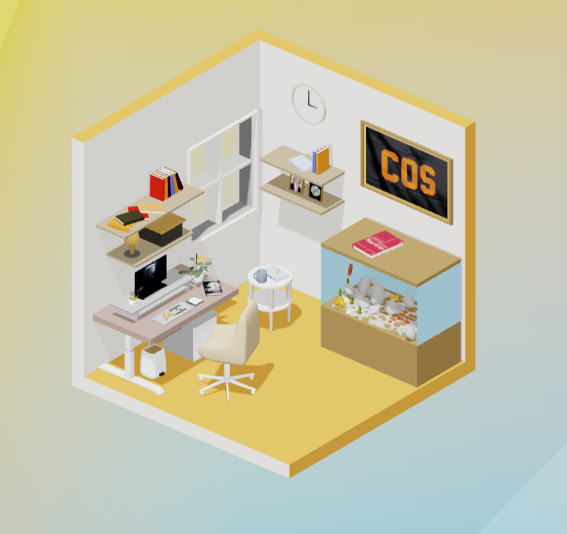

<a name="readme-top"></a>

<!-- PROJECT SHIELDS -->
<!--
*** I'm using markdown "reference style" links for readability.
*** Reference links are enclosed in brackets [ ] instead of parentheses ( ).
*** See the bottom of this document for the declaration of the reference variables
*** for contributors-url, forks-url, etc. This is an optional, concise syntax you may use.
*** https://www.markdownguide.org/basic-syntax/#reference-style-links
-->

[![Contributors][contributors-shield]][contributors-url]
[![Forks][forks-shield]][forks-url]
[![Stargazers][stars-shield]][stars-url]
[![Issues][issues-shield]][issues-url]
[![MIT License][license-shield]][license-url]
[![LinkedIn][linkedin-shield]][linkedin-url]

<!-- PROJECT LOGO -->
<br />
<div align="center">
  <a href="https://github.com/Shivamkak19/ai-house">
    
  </a>

<h3 align="center">Project Description</h3>

Ai-house is a three.js learning project that utilizes a GLTF model loaded into the web environment. This project serves as the website for AI @ Princeton, an organization focused on teaching students on campus about developments and opportunities in the field of AI and machine learning.

<br />

<a href="https://github.com/Shivamkak19/ai-house/images">View Product</a>
·
<a href="https://github.com/Shivamkak19/ai-house/issues">Report Bug</a>
·
<a href="https://github.com/Shivamkak19/ai-house/issues">Request Feature</a>
</div>

<!-- TABLE OF CONTENTS -->
<details>
  <summary>Table of Contents</summary>
  <ol>
    <li>
      <a href="#about-the-project">About The Project</a>
      <ul>
        <li><a href="#built-with">Built With</a></li>
      </ul>
    </li>
    <li>
      <a href="#getting-started">Getting Started</a>
      <ul>
        <li><a href="#prerequisites">Prerequisites</a></li>
        <li><a href="#installation">Installation</a></li>
      </ul>
    </li>
    <li><a href="#roadmap">Roadmap</a></li>
    <li><a href="#contributing">Contributing</a></li>
    <li><a href="#license">License</a></li>
    <li><a href="#contact">Contact</a></li>
    <li><a href="#acknowledgments">Acknowledgments</a></li>
  </ol>
</details>

<!-- ABOUT THE PROJECT -->
## About the Project

[![Product Name Screen Shot][product-screenshot]](https://ai-house.vercel.app/)

<p align="right">(<a href="#readme-top">back to top</a>)</p>

### Built With

* [![Three.js][threedotjs]][threedotjs-url]
* [![Node.js][nodedotjs]][nodedotjs-url]
* [![GSAP][greensock]][greensock-url]
* [![Vite.js][vite]][vite-url]
* [![Blender][blender]][blender-url]

<p align="right">(<a href="#readme-top">back to top</a>)</p>


<!-- GETTING STARTED -->
## Getting Started

Below, I have included the necessary steps to set up ai-house locally. 

### Prerequisites

To run this project, you must download the latest version of the npm package manager and Blender 3.6.1.

  ```sh
  npm install npm@latest -g
  ```


### Installation

1. Clone the repo
   ```sh
   git clone https://github.com/Shivamkak19/ai-house.git
   ```

2. Install NPM packages
   ```sh
   npm install
   ```

3. Vite local deployment
   ```sh
   npm run dev
   ```

4. Vite build
   ```sh
   npm run build
   ```

5. Vite preview
   ```sh
   npm run preview
   ```
   
<p align="right">(<a href="#readme-top">back to top</a>)</p>

<!-- ROADMAP -->
## Roadmap

- [ ] Design 3D model in Blender
    - [ ] Export GLTF, import in three.js scene via DracoLoader
- [ ] Construct Three.js scene via Singleton design pattern
- [ ] Overlay scene onto HTML/CSS

See the [open issues](https://github.com/Shivamkak19/ai-house/issues) for a full list of proposed features (and known issues).

<p align="right">(<a href="#readme-top">back to top</a>)</p>

<!-- CONTRIBUTING -->
## Contributing

If you have a suggestion that would make this project better, please feel free to fork the repo, expirement with features of your own, and create a pull request. You can also simply open an issue with the tag "enhancement". 

1. Fork the Project
2. Create your Feature Branch (`git checkout -b feature/newFeature`)
3. Commit your Changes (`git commit -m 'Add some new feature to ai-house'`)
4. Push to the Branch (`git push origin feature/newFeature`)
5. Open a Pull Request

<p align="right">(<a href="#readme-top">back to top</a>)</p>

<!-- LICENSE -->
## License

Distributed under the MIT License. See `LICENSE` for more information.

<p align="right">(<a href="#readme-top">back to top</a>)</p>


<!-- CONTACT -->
## Contact

* Alex Zhang: alzhang@princeton.edu
* Shivam Kak: sk3686@princeton.edu
* Project Link: [https://github.com/Shivamkak19/ai-house](https://github.com/Shivamkak19/ai-house)

<p align="right">(<a href="#readme-top">back to top</a>)</p>


<!-- ACKNOWLEDGMENTS -->
## Acknowledgments

* []() Woan Coding, three.js dev youtuber (https://www.youtube.com/@pandawoan) for blender and three.js instruction.
* []() Chris Courses, web development youtuber (https://www.youtube.com/@ChrisCourses), for tutorials on three.js scene creation.
* []() Tadeus, 3D graphics artist, for the blender model of the low-poly tiger available as:

<br />
 "Low Poly - Tiger" (https://skfb.ly/6YOEX) by tadeus is licensed under Creative Commons Attribution (http://creativecommons.org/licenses/by/4.0/).

<p align="right">(<a href="#readme-top">back to top</a>)</p>


<!-- MARKDOWN LINKS & IMAGES -->
<!-- https://www.markdownguide.org/basic-syntax/#reference-style-links -->
[contributors-shield]: https://img.shields.io/github/contributors/Shivamkak19/ai-house.svg?style=for-the-badge
[contributors-url]: https://github.com/Shivamkak19/ai-house/graphs/contributors
[forks-shield]: https://img.shields.io/github/forks/Shivamkak19/ai-house.svg?style=for-the-badge
[forks-url]: https://github.com/Shivamkak19/ai-house/network/members
[stars-shield]: https://img.shields.io/github/stars/Shivamkak19/ai-house.svg?style=for-the-badge
[stars-url]: https://github.com/Shivamkak19/ai-house/stargazers
[issues-shield]: https://img.shields.io/github/issues/Shivamkak19/ai-house.svg?style=for-the-badge
[issues-url]: https://github.com/Shivamkak19/ai-house/issues
[license-shield]: https://img.shields.io/github/license/Shivamkak19/ai-house.svg?style=for-the-badge
[license-url]: https://github.com/Shivamkak19/ai-house/blob/master/LICENSE
[linkedin-shield]: https://img.shields.io/badge/-LinkedIn-black.svg?style=for-the-badge&logo=linkedin&colorB=555
[linkedin-url]: https://linkedin.com/in/shivamkak
[product-screenshot]: images/product-1.png
[product-screenshot2]: images/product-2.jpg
[product-screenshot3]: images/product-3.jpg

<!-- Programming Language Shields -->
[threedotjs]:  https://img.shields.io/badge/Three.js-6592e6?style=for-the-badge&logo=threedotjs&logoColor=000000
[threedotjs-url]: https://threejs.org/

[nodedotjs]: https://img.shields.io/badge/Node.js-333333?style=for-the-badge&logo=nodedotjs&logoColor=3f873e
[nodedotjs-url]: https://nodejs.org/en

[greensock]: https://img.shields.io/badge/GSAP-88ce02?style=for-the-badge&logo=greensock&logoColor=000000
[greensock-url]: https://greensock.com/gsap/

[vite]: https://img.shields.io/badge/Vite.js-ac49fe?style=for-the-badge&logo=vite&logoColor=ffd52e
[vite-url]: https://vitejs.dev/

[blender]: https://img.shields.io/badge/Blender-165a8f?style=for-the-badge&logo=blender&logoColor=f4792b
[blender-url]: https://www.blender.org/
